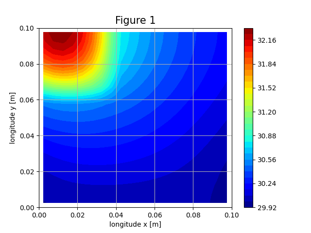

# CFD Partial Exam 
## 2D Steady-State Heat Diffusion by the Finite Volume Method

FIE-UNDEF · Introducción a la Dinámica de Fluidos Computacional · 2026-S1

---

## 1. Problem statement

Metal plate `10 × 10 × 1 cm` containing two metallic sectors:

| Sector | Size | `k` [W/m/K] | Generation `q̇` [W/m³] |
|--------|------|-------------|-----------------------|
| A      | 4 × 4 × 1 cm | 100   | 5.0 × 10⁵ |
| B      | remainder    | 550   | 0 |

Governing equation (pure diffusion, no convection):

$$\frac{\partial}{\partial x}\left(k\,\frac{\partial T}{\partial x}\right) + \frac{\partial}{\partial y}\left(k\,\frac{\partial T}{\partial y}\right) + \dot{q} = 0$$

### Boundary conditions

| Edge | Type | Condition |
|------|------|-----------|
| North | Neumann | insulated, ∂T/∂n = 0 |
| South | Dirichlet | T = 30 °C |
| East / West | Robin (convective) | −k ∂T/∂n = h (T − T∞), h = 200 W/m²/K, T∞ = 15 °C |
| Front / Back (z) | Neumann | insulated → 2D problem |

### Configurations

- **Fig. 1 (base):** sector A in the top-left corner.
- **Fig. 2 (alt):** sector A in the bottom-right corner.

---

## 2. Tasks

- [x] Solve `T(x,y)` by FVM (Fig. 1).
- [x] Contour plot of `T(x,y)`.
- [x] Temperature profile along the diagonal crossing sector A.
- [x] Solve `T(x,y)` for Fig. 2; contour plot.
- [x] Energy balance: does the system hold the same total energy in each configuration? Justify with calculations from the results.

---

## 3. Method

The steady diffusion equation is integrated over each control volume of a uniform structured mesh of `nx × ny` cells, with one node at each cell centroid. The face-flux balance yields one algebraic equation per node:

$$a_P\,T_P = a_E\,T_E + a_W\,T_W + a_N\,T_N + a_S\,T_S + b$$

with neighbour coefficients of the form

$$a_E = \frac{k_e\,\Delta y\,h}{\delta x_e}, \qquad a_P = a_E + a_W + a_N + a_S \;(+\text{boundary terms})$$

Key ingredients:

- **Material interface (harmonic mean):** the conductivity at a face between cells `P` and `E` is

  $$k_f = \frac{2\,k_P\,k_E}{k_P + k_E}$$

  which enforces flux continuity across the A–B interface. Validity requires the interface to coincide with cell faces, hence **`nx` and `ny` must be multiples of 5** (enforced by assertions).
- **Source term:** `b = q̇ Δx Δy h` only in cells belonging to sector A; the two configurations differ solely in the membership test `inSectorA(i, j)`, selected by the `config` flag.
- **Boundary conditions** folded into `a_P` and `b` (no ghost cells):
  - *Dirichlet (south):* half-cell conductance `a_b = k_P Δx h / (Δy/2)`, with `a_P += a_b`, `b += a_b T_S`.
  - *Robin (west/east):* series conduction–convection resistance eliminating the surface temperature,

    $$a_{rob} = \frac{\Delta y\,h}{\dfrac{\Delta x}{2 k_P} + \dfrac{1}{h_b}}, \qquad a_P \mathrel{+}= a_{rob},\quad b \mathrel{+}= a_{rob}\,T_\infty$$
  - *Neumann (north, front/back):* the face term is simply absent (coefficient left at zero).
- **Solver:** Gauss–Seidel iteration, stopping when the ℓ² norm of the change between sweeps falls below `10⁻⁶` (max 30 000 iterations). Diagonal dominance (Scarborough criterion) is asserted before iterating.
- **Verification:**
  1. per-cell residual of the discrete equation, `max |R| < 10⁻⁴`;
  2. face-coefficient symmetry (E/W and N/S pairs);
  3. global energy balance, `|Q_gen − (Q_S + Q_W + Q_E)| / Q_gen < 10⁻³`.


    
---

## 4. Repository layout

```
.
├── 2D_diffusion.py     # FVM solver, validation, energy balance, plots
├── Report.pdf          # Technical report (Informe Técnico - Examen Parcial)
├── README.md
└── images/
    ├── Figure1.png    # T(x,y) contour, sector A top-left
    ├── Figure2.png    # T(x,y) contour, sector A bottom-right
    ├── Diagonal1.png   # T along the TL→BR diagonal, config 1
    ├── Diagonal2.png   # T along the TL→BR diagonal, config 2
    ├── ComparisonX.png            # T_max vs horizontal position of sector A
    └── ComparisonY.png            # T_max vs vertical position of sector A
```

---

## 5. Parameters

| Symbol  | Value | Unit | Notes |
|---------|-------|------|-------|
| Lx, Ly  | 0.10  | m | plate side |
| t       | 0.01  | m | thickness |
| k_A     | 100   | W/m/K | |
| k_B     | 550   | W/m/K | |
| q̇_A    | 5.0e5 | W/m³ | sector A only |
| T_south | 30    | °C | Dirichlet |
| T∞      | 15    | °C | E/W fluid |
| hb      | 200   | W/m²/K | E/W convection |
| Nx, Ny  | 50 × 50 | — | report mesh (script defaults to 20 × 20); multiples of 5 required |

---

## 6. How to run

Requirements: Python 3 with `numpy`, `scipy`, `matplotlib`.

```bash
python 2D_diffusion.py
```

Set `config = 1` (sector A top-left) or `config = 2` (bottom-right) at the top of the script. Mesh resolution is set through `nx`, `ny` (must be multiples of 5). The script prints global results to screen and shows the contour and diagonal plots.

---

## 7. Results

Reference mesh: 50 × 50 (Δx = Δy = 0.002 m).

| Quantity | Config 1 (A top-left) | Config 2 (A bottom-right) |
|----------|----------------------|---------------------------|
| T_max [°C] | 32.30 | 30.76 |
| T_min [°C] | 29.97 | 29.65 |
| Q_gen [W]  | 8.00  | 8.00  |
| Q_S [W]    | 1.84  | 2.04  |
| Q_W [W]    | 3.15  | 2.95  |
| Q_E [W]    | 3.01  | 3.01  |

**Energy balance.** The generated power depends only on `q̇` and the volume of sector A:

$$Q_{gen} = \dot{q}\,L_{Ax}\,L_{Ay}\,h = (5\times 10^5)(0.04)(0.04)(0.01) = 8.0\ \text{W}$$

Neither factor changes when sector A is relocated, and at steady state nothing accumulates, so

$$Q_{gen} = Q_S + Q_W + Q_E = 8.0\ \text{W}$$

in both configurations. The position of sector A does **not** change the total power exchanged; it changes its routing among the three sinks and the peak temperature needed to drive it. Config 1 (A near the adiabatic north wall) yields the higher T_max; config 2 (A near the Dirichlet south wall) the lower.

A position sweep of sector A (see `images/ComparisonX.png`, `images/ComparisonY.png`) confirms this: moving A horizontally gives a symmetric T_max curve (identical Robin walls), while moving it vertically gives a monotonic one (adiabatic north vs. Dirichlet south).

---

## 8. Notes / pitfalls

- **Mesh constraint:** `nx`, `ny` multiples of 5, otherwise the A–B interface cuts through cell interiors and the harmonic-mean face conductivity is invalid.
- **Harmonic vs. arithmetic mean:** the arithmetic mean does not preserve flux continuity across the interface (it fails badly when one conductivity is small).
- **Convergence criterion vs. validation:** the stopping criterion (ℓ² norm of the field increment) and the residual assertion measure different quantities; the residual check (`max |R| < 10⁻⁴`) is the authoritative one. A normalized increment criterion can produce false convergence with large field magnitudes.
- **`iterMax`:** configuration 2 converges more slowly; an insufficient iteration cap silently exits the loop without converging — the residual assertion catches this.
- **Heat flux vs. heat rate:** `J` [W/m²] vs. `Q` [W], `Q = J·A`; the energy balance is stated in rates.
- **Indexing:** the solver arrays are padded by one cell on each side; boundary extraction for the energy balance must use the unpadded `T_final`.

